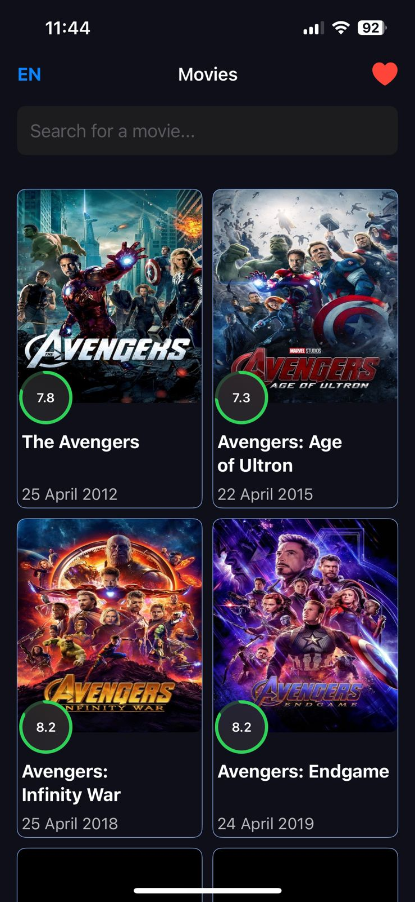
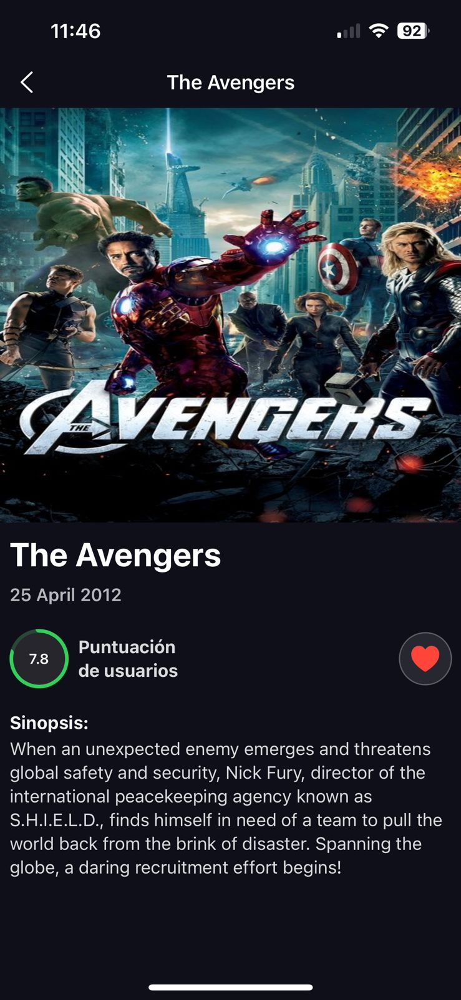
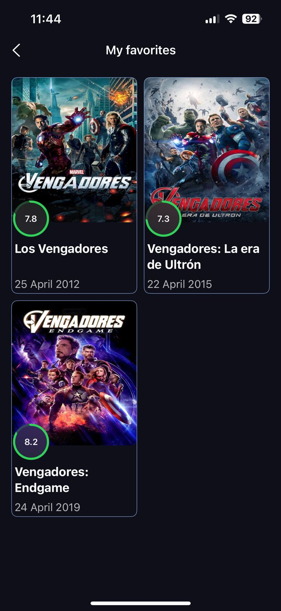

# 🎬 AvengersApp – Prueba Técnica iOS 

<table align="center">
  <tr>
    <td align="center">
      
      <br>Home Screen
    </td>
    <td align="center">
      
      <br>Details Screen
    </td>
      <td align="center">
      
      <br>My Favorites Screen
    </td>
  </tr>
</table>

## 📱 Descripción
AvengersApp es una aplicación desarrollada en SwiftUI que consume la API pública de The Movie Database (TMDB)
Permite explorar una lista de películas, consultar sus detalles y agregar favoritos utilizando persistencia local con Core Data.
El proyecto fue construido siguiendo buenas prácticas de arquitectura (MVVM), aprovechando async/await para manejo de concurrencia moderna, y cuenta con pruebas unitarias y de interfaz (Unit y UI Tests).

## 🧩 Características principales
- Listado de peliculas obtenidas desde la API pública de The Movie Database (TMDB) mostrando inicialmente solo peliculas de Avengers
- Pantalla de detalles que contiene poster, titulo, calificación,fecha estreno,sinopsis,botón para añadir a favoritos
- Buscador de peliculas nos permite buscar cualquier pelicula que se encuentre en el API de TMDBS
- Peliculas favoritas con persistencia de datos con **Core Data** se accede desde la NavigationBar presionando el icono de ❤️
- Diseño moderno con SwiftUI
- Arquitectura MVVM, separando Lógica de negocio, Vistas y Modelos
- Uso de localizable para mostrar Títulos de la barra de navegación en Ingles/Español dependiendo configuración de idioma del dispositivo
- Uso de Async/ Await para peticiones asíncronas limpias.
- Pruebas Unitarias (XCTest)
- Pruebas UI (XCUITest)
- Se pueden obtener la Información de la pelicula en Ingles/ Español presionando en la NavigationBar en la parte Izquierda (EN/ES)

## ⚙️ Tecnologías utilizadas
| Tecnología                        | Descripción                        |
| --------------------------------- | ---------------------------------- |
| **Swift 6.1.2**                   | Lenguaje principal                 |
| **SwiftUI**                       | Framework de interfaz declarativa  |
| **MVVM**                          | Patrón de arquitectura             |
| **Core Data**                     | Persistencia de datos              |
| **Async/Await**                   | Concurrencia moderna               |
| **XCTest / XCUITest**             | Testing unitario y de interfaz     |
| **The Movie Database API (TMDB)** | Fuente de datos                    |

## 💾 Gestión de Favoritos con Core Data
La sección de favoritos en AvengersApp se implementa usando **Core Data** con **NSFetchRequest**
### Razones para esta elección
1. Las consultas son precisas y Eficientes.
   - **NSFetchRequest** permite filtrar, ordenar y limitar los resultados directamente desde la base de datos, evitando cargar toda la información en memoria.
   - De esta manera permite muchas operaciones de manera eficiente.
2. Integración con MVVM y SwiftUI
   - En el caso de la aplicación se esta ejecutando las consultas en el viewModel para obtener las peliculas favoritas, permitiendonos tener la separación de responsabilidades
   - La UI se actualizara automaticamente ya que se integra apropiadamente con @Published en el caso de AvengersApp
3. Escalabilidad y relaciones
   - Core Data es eficiente a nivel de escalabilidad y nos permite realizar relaciones.
4. Es mejor que las alternativas (para este proyecto)
   - UserDefaults: Solo útil para datos simples, no para listas complejas ni consultas.
   - Realm: Potente pero requiere librerías externas y wrappers adicionales para SwiftUI.
   - Core Data + NSFetchRequest: Nativo, eficiente, escalable y perfectamente integrado con SwiftUI.
     
## 🏗️ Arquitectura (MVVM)
El proyecto está organizado bajo el patrón Model-View-ViewModel para promover modularidad, escalabilidad y testabilidad.
```
├── AvengersApp
│   ├── App
│   │   ├── Assets.xcassets
│   │   │   ├── AccentColor.colorset
│   │   │   │   └── Contents.json
│   │   │   ├── AppIcon.appiconset
│   │   │   │   └── Contents.json
│   │   │   ├── Colors
│   │   │   │   ├── Contents.json
│   │   │   │   ├── background.colorset
│   │   │   │   ├── borderCard.colorset
│   │   │   │   └── toastBg.colorset
│   │   │   └── Contents.json
│   │   ├── AvengersAppApp.swift
│   │   ├── en.lproj
│   │   │   └── Localizable.strings
│   │   └── es-419.lproj
│   │       └── Localizable.strings
│   ├── Models
│   │   └── MoviesResponse.swift
│   ├── Network
│   │   ├── APIConstants.swift
│   │   └── NetworkManager.swift
│   ├── Persistence
│   │   ├── AvengersApp.xcdatamodeld
│   │   │   └── AvengersApp.xcdatamodel
│   │   │       └── contents
│   │   └── Persistence.swift
│   ├── Test
│   │   ├── AvengersAppTests
│   │   │   └── FavoriteViewModelTests.swift
│   │   └── AvengersUIAppTests
│   │       └── AvengersAppUITests.swift
│   ├── Utils
│   │   ├── AppUtils.swift
│   │   ├── Enums.swift
│   │   └── MyAppManager.swift
│   ├── View
│   │   ├── Components
│   │   │   ├── CardItemsView.swift
│   │   │   ├── DescriptionView.swift
│   │   │   ├── EmptyDataView.swift
│   │   │   ├── GeneralMovieInformationView.swift
│   │   │   ├── PosterView.swift
│   │   │   ├── SearchBarView.swift
│   │   │   ├── ToastMessage.swift
│   │   │   └── VoteProgressCircle.swift
│   │   ├── ContentView.swift
│   │   ├── DetailView.swift
│   │   ├── FavoritesView.swift
│   │   └── HomeView.swift
│   └── ViewModel
│       ├── FavoriteViewModel.swift
│       └── MovieViewModel.swift
```
## 🔑 Configuración del proyecto
```bash
1.Clonar el repositorio:
https://github.com/NahumMartinez01/PruebaTecnica.git
```
```bash
2. Abrir el proyecto
open AvengersApp.xcodeproj
```
## 🧪 Pruebas
Para ejecutar las pruebas:
```bash
Cmd + U
```
O desde Xcode → Product → Test.
Tipos de pruebas
- ✅ Unit Tests: Validan la lógica de negocio (ViewModels y Guardado favorito).
- 🧭 UI Tests: Simulan interacciones de usuario (favoritos, navegaciónes).
## 🧠 Buenas prácticas aplicadas
- Uso de MVVM con responsabilidad clara por capa.
- Inyección de dependencias para facilitar testing.
- Uso de @StateObject en vistas SwiftUI.
- Creación de componentes.
- Async/Await para un código más legible y moderno.
- Core Data con capa de persistencia centralizada.
- Tests para asegurar la calidad del código.
